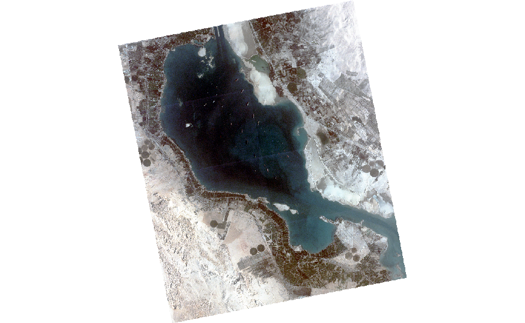
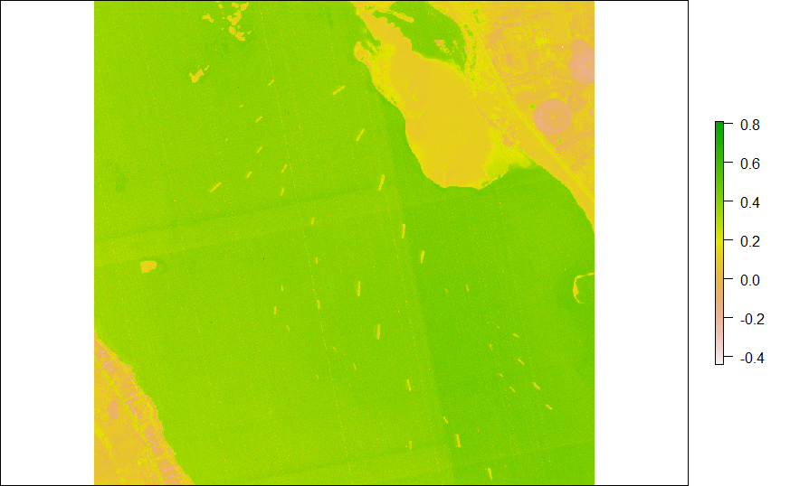
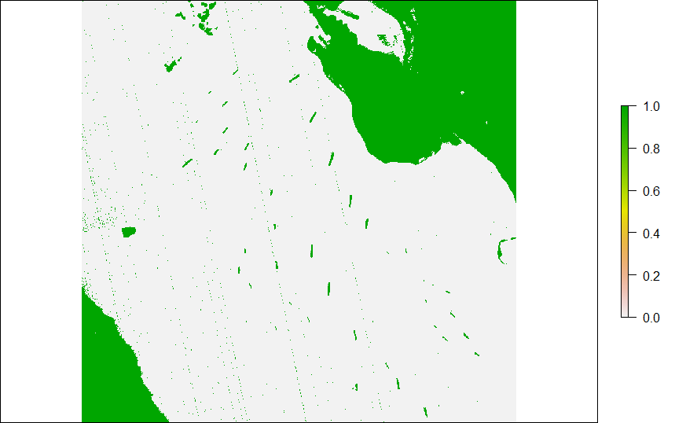
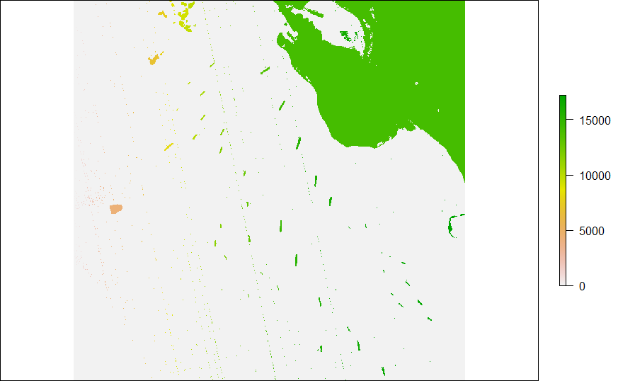
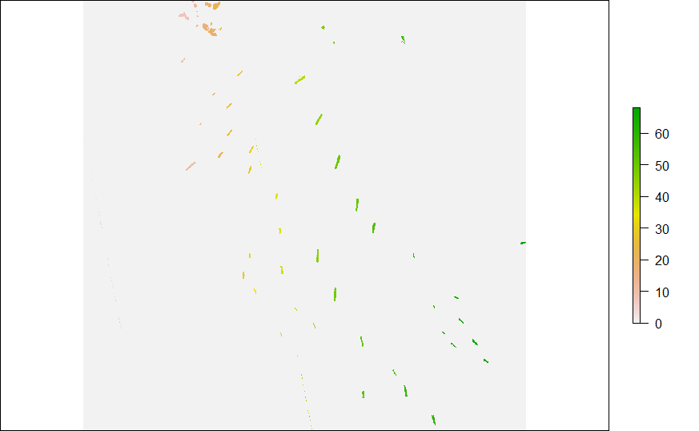
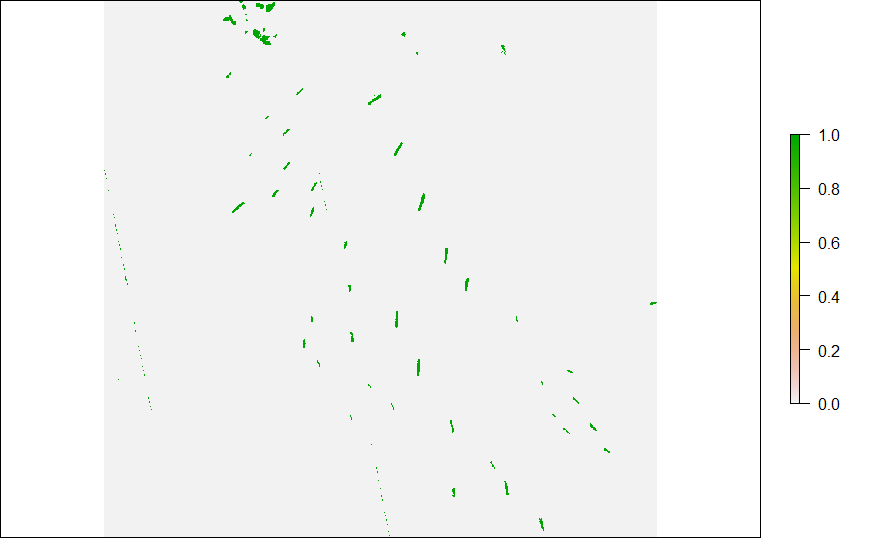
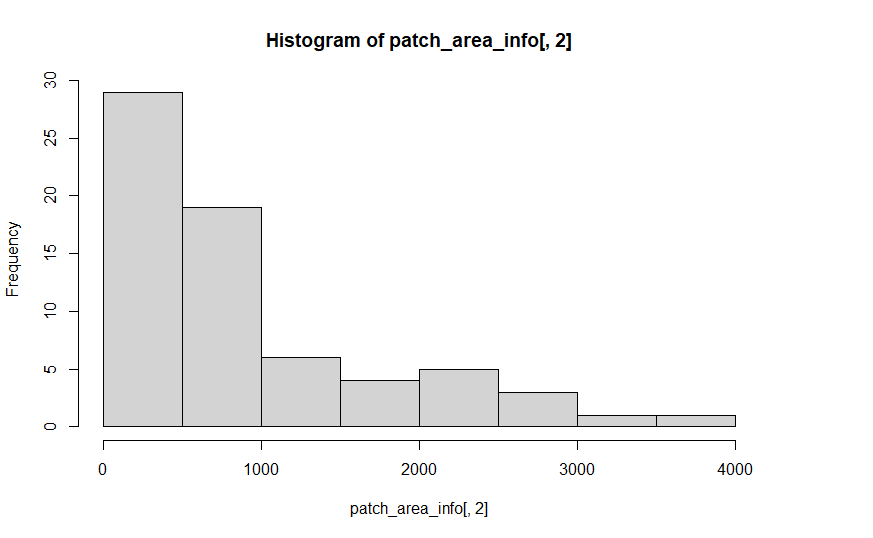
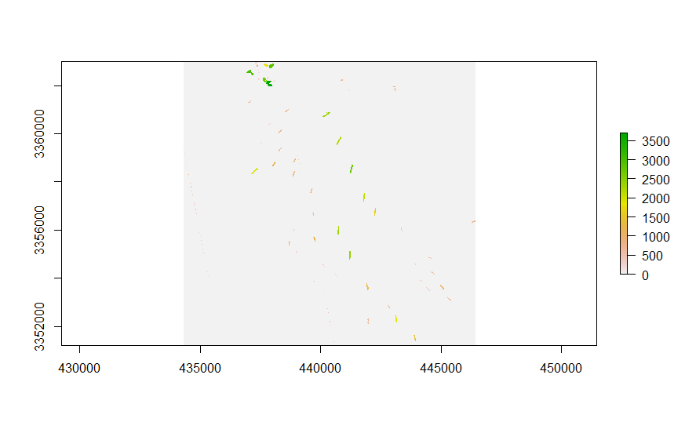
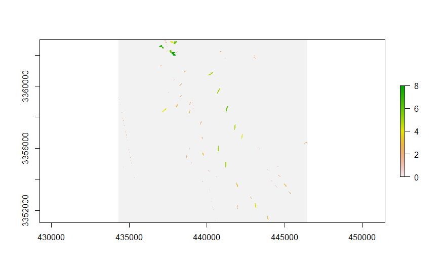

# PlanetScope-ShipDetection-SizeClassification

## A Quick Ship detection method
## Size classification

## 1. Load library
```
library(raster)
library(biclust)
library(SDMTools)
```

## 2. Load and PlanetScope data
```
great_bitter_lake = stack("great_bitter_merge.tif")
plotRGB(great_bitter_lake,
        r = 3, g = 2, b = 1,
        stretch = "hist",
        legend = FALSE,
        axes = FALSE,
        box = FALSE)
```
<!-- -->

## 3. Draw extent and crop
```
e <- drawExtent()
cropped_great_bitter <- crop(great_bitter_lake, e)
plotRGB(cropped_great_bitter,
        r = 3, g = 2, b = 1,
        stretch = "hist",
        legend = FALSE,
        axes = FALSE,
        box = FALSE)
```

<!-- -->

## 4. Calculate NDWI
```
great_bitter_lake_NDWI = (cropped_great_bitter[[2]] - cropped_great_bitter[[4]]) / (cropped_great_bitter[[2]] + cropped_great_bitter[[4]])
plot(great_bitter_lake_NDWI)
```

<!-- -->

## 5. Binarize
```
binwater = 1-binarize(great_bitter_lake_NDWI,threshold=0.3)
plot(binwater)
```

<!-- -->

## 6. Connected components labelling
```
patch = SDMTools::ConnCompLabel(binwater)
plot(patch)
```
<!-- -->

## 7. Create dataframe
```
patch_area = data.frame(matrix(ncol = 2, nrow = max(values(patch))))
c = c("Index", "Area")
colnames(patch_area) = c

patch_area[,1] = 1:nrow(patch_area)
```

## 8. Create function to calculate area of raster patches
```
calculate_area <- function(patch_number)
{
  area <- sum(patch[] == patch_number)
  return(area)
}
```
## 9. Calculate raster area
```
patch_area[,2] = sapply(seq(1:nrow(patch_area)), calculate_area)
```

## 10. Outlier
```
bigPatchIDs = which(patch_area[,2] >= 150 & patch_area[,2] <= 5000)
test = match(patch, bigPatchIDs, nomatch=0)
plot(test)
```
<!-- -->

# Nice and Clean

## Second part, we are going to repeat Binarize, ConnCompLabel, area calculation and finally reclassify the ship by their size

## 1. Binarize
```
binarize_again = binarize(test, threshold = 0)
plot(binarize_again)
```
<!-- -->

## 2. ConnCompLabel
```
patch = SDMTools::ConnCompLabel(binarize_again)
plot(patch)
```
<!-- -->


## 3. Dataframe
```
patch_area_info = data.frame(matrix(ncol = 2, nrow = max(values(patch))))
c = c("Index", "Area")
colnames(patch_area_info) = c

patch_area_info[,1] = 1:nrow(patch_area_info)
```

## 4. Calculate area
```
patch_area_info[,2] = sapply(seq(1:nrow(patch_area_info)), calculate_area)
```

## 5. Histogram of ship size
```
hist(patch_area_info[,2])
```
<!-- -->

## 6. Change value of raster by thier size
```
raster_area = patch

plot(raster_area)
for(i in 1:nrow(patch_info))
{
  raster_area[raster_area == i] = patch_info[i,2]
}

plot(raster_area)
```
<!-- -->

## 7. Reclassify
```
reclass_raster = reclassify(raster_area, c(0,500,1, 500,1000,2, 1000,1500,3, 1500,2000,4, 2000,2500,5, 2500,3000,6, 3000,3500,7, 3500,4000,8, 4000,4500,9, 4500,5000,10))

plot(reclass_raster)
```
<!-- -->
